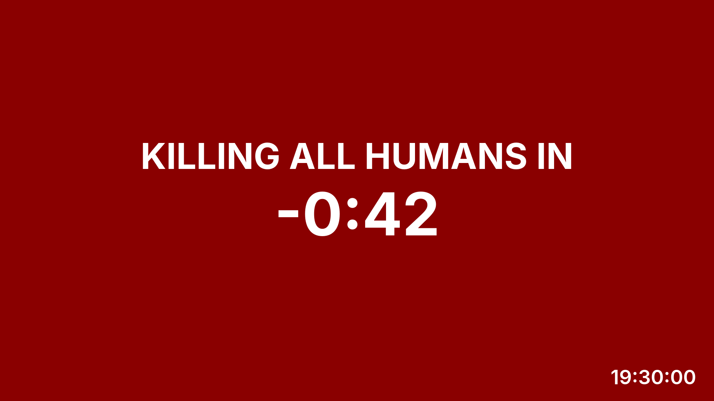

# placard

A single-purpose appliance that drives one 1080p display with a solid
background colour and big, centred text. It is controlled over the network —
OSC (so QLab can cue it), newline-delimited JSON over TCP, or plain HTTP —
survives power loss by resuming its last scene, and fails to black with
automatic restart. One Rust binary, one GStreamer pipeline, systemd, a
fanless mini PC.

<p>
  
  
</p>

Those frames are the actual golden test images: the pipeline renders them in
CI and pixel-compares every release.

## What it does

- Arbitrary text or canned messages from config (`house_open`, `go`,
  `show_stop`, …), word-wrapped and auto-shrunk to fit. Text renders
  literally — a `<b>` in a cue shows as `<b>`.
- Countdowns to an absolute UTC instant or N seconds from receipt. They run
  through zero and keep counting negative — a stage manager wants "two
  minutes over", not "done".
- A wall clock always in the corner, across every cue.
- A `flash` flag that inverts the colours every 500 ms for 3 s when a
  message lands.
- Pull the power mid-countdown and it comes back on the same countdown,
  unattended. Any fault → black → systemd restarts it; a hung process or
  kernel trips the hardware watchdog.
- A read-only history page at `http://<box>:8080/` showing every inbound
  message, its source, raw wire text and outcome — rejects included.

## Controlling it

| Transport | Port | Format |
|---|---|---|
| OSC | 9000/udp | `/placard/…` address space |
| TCP | 9001 | one JSON object per line, one reply line each |
| HTTP | 8080 | `POST /api/command`, `GET /api/status`, `GET /api/history` |

```sh
oscsend placard-01 9000 /placard/canned s house_open
oscsend placard-01 9000 /placard/countdown/secs is 300 "House opens in"
oscsend placard-01 9000 /placard/show si "SHOW STOP" 1        # 1 = flash

curl -d '{"cmd":"show","text":"STAND BY","bg":"000000"}' placard-01:8080/api/command
printf '{"cmd":"clear"}\n' | nc placard-01 9001
```

Colours are bare `rrggbb`. Bad input of any kind gets an error reply on the
same transport and leaves the screen untouched — nothing a client sends can
take the display down. The full wire format is in
[docs/protocol.md](docs/protocol.md).

## Developing

Day-to-day development is on macOS; the appliance is a verification target.

```sh
brew install rustup pkg-config gstreamer liblo ansible
brew install --cask font-inter

make run    # 1920x1080 window, control it on localhost
make test   # fmt, clippy -D warnings, unit + integration tests
```

QLab on the same Mac can fire the real cue stack at `localhost` before any
hardware exists. Rendering fidelity is asserted only on Linux:
`make goldens` regenerates the reference PNGs inside the same
`debian:trixie` image CI uses, running natively on your host architecture
(needs Docker or podman) — cross-architecture rendering is verified within
the golden tolerance, and CI re-asserts on amd64 every push. Only
`make linux-bin` is pinned to amd64, because the box is.

`placard --snapshot scene.json out.png` renders one frame of a scene
fixture through the real pipeline — that's what the golden tests and the
images above come from.

## Releasing and deploying

Every push to `main` is a release: CI builds in a trixie container, runs the
full suite including golden images, and attaches a checksummed `.deb` to a
GitHub Release tagged with the UTC build time (`YYYYMMDDHHMMSS`).

Boxes are provisioned by Ansible from a stock Debian 13 netinst — kernel
cmdline, watchdog, templated config, and whatever release is latest.
Re-run the playbook to upgrade; pin `placard_release` to a release tag to
roll back or hold a box. See [docs/deploy.md](docs/deploy.md).

## Documentation

| File | What |
|---|---|
| [docs/DESIGN.md](docs/DESIGN.md) | The spec: architecture, hardware, milestones |
| [docs/protocol.md](docs/protocol.md) | Wire formats for all three transports |
| [docs/deploy.md](docs/deploy.md) | Provisioning, upgrades, bench workflow |
| [docs/decisions.md](docs/decisions.md) | Why it is the way it is |
| [CLAUDE.md](CLAUDE.md) | Rules for implementers, human or otherwise |

## Provenance

This project is entirely LLM-written: the design docs, every line of code,
the tests, CI, provisioning and this README were produced by Claude (Fable
5) working under human direction and review. The human contributions are
the requirements, the taste, and the decisions about what not to build.
